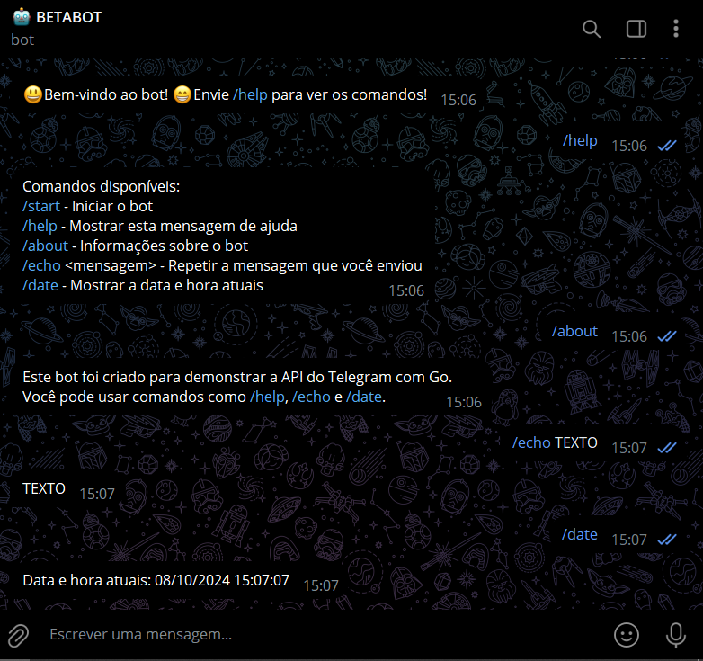

# TELEGRAM BOT EM GO
🤤ESTE BOT FOI DESENVOLVIDO EM GO UTILIZANDO A API DO TELEGRAM.

 <br>

## DESCRIÇÃO:
Este bot foi desenvolvido em Go utilizando a API do Telegram. Ele responde a vários comandos que você pode enviar diretamente para ele em uma conversa privada. É um bot básico, mas personalizável, que pode ser expandido para incluir mais funcionalidades.

## FUNCIONALIDADES:
- **`/start`**: Inicia a conversa com o bot e envia uma mensagem de boas-vindas.
- **`/help`**: Exibe uma lista de comandos disponíveis que o usuário pode utilizar.
- **`/about`**: Fornece uma breve descrição do bot e seu propósito.
- **`/echo <mensagem>`**: Repete a mensagem fornecida pelo usuário. Se o usuário não fornecer uma mensagem, o bot solicita que seja inserida.
- **`/date`**: Exibe a data e hora atuais no formato `dd/mm/yyyy hh:mm:ss`.

## EXECUTANDO O PROJETO:
1. **Configurar Token do Telegram**:
   - Abra o arquivo `./CODIGO/.env` e coloque sua credêncial:
     ```env
     TOKEN=seu_token_do_bot_aqui
     ```
   - Substitua `seu_token_do_bot_aqui` pelo [token](https://t.me/BotFather) do seu bot do Telegram.

2. **Executar o Bot**:
   - Navegue até o diretório `./CODIGO`, e inicie o bot rodando o comando:
     ```bash
     go run main.go
     ```
   - O bot estará pronto para interagir com você no Telegram!

3. **Interagindo com o Bot**:
   1. **Iniciar o Bot**:
      - No Telegram, inicie uma conversa com o bot enviando o comando `/start`. Isso fará com que o bot envie uma mensagem de boas-vindas.

   2. **Ver Lista de Comandos**:
      - Envie o comando `/help` para receber uma lista de comandos disponíveis e o que cada um faz.

   3. **Obter Informações sobre o Bot**:
      - Envie o comando `/about` para aprender mais sobre o bot e seu propósito.

   4. **Repetir uma Mensagem**:
      - Envie o comando `/echo <mensagem>` para que o bot repita exatamente o que você enviar como argumento. Por exemplo, enviar `/echo Olá!` resultará na resposta "Olá!".
      - Caso não envie uma mensagem junto com o comando, o bot solicitará que você insira uma.

   5. **Obter Data e Hora Atuais**:
      - Envie o comando `/date` para obter a data e hora atuais formatadas.

## NÃO SABE?
- Entendemos que para manipular arquivos em muitas linguagens e tecnologias relacionadas, é necessário possuir conhecimento nessas áreas. Para auxiliar nesse aprendizado, oferecemos alguns subsidios:
* [VEJA A DOCUMENTAÇÃO](https://core.telegram.org/bots/api)
* [CURSO SUGERIDO](https://github.com/VILHALVA/CURSO-DE-TELEBOT)
* [CURSO DE GOLANG](https://github.com/VILHALVA/CURSO-DE-GOLANG)
* [CONFIRA MAIS CURSOS](https://github.com/VILHALVA?tab=repositories&q=+topic:CURSO)

## CREDITOS:
- [PROJETO CRIADO PELO VILHALVA](https://github.com/VILHALVA)

